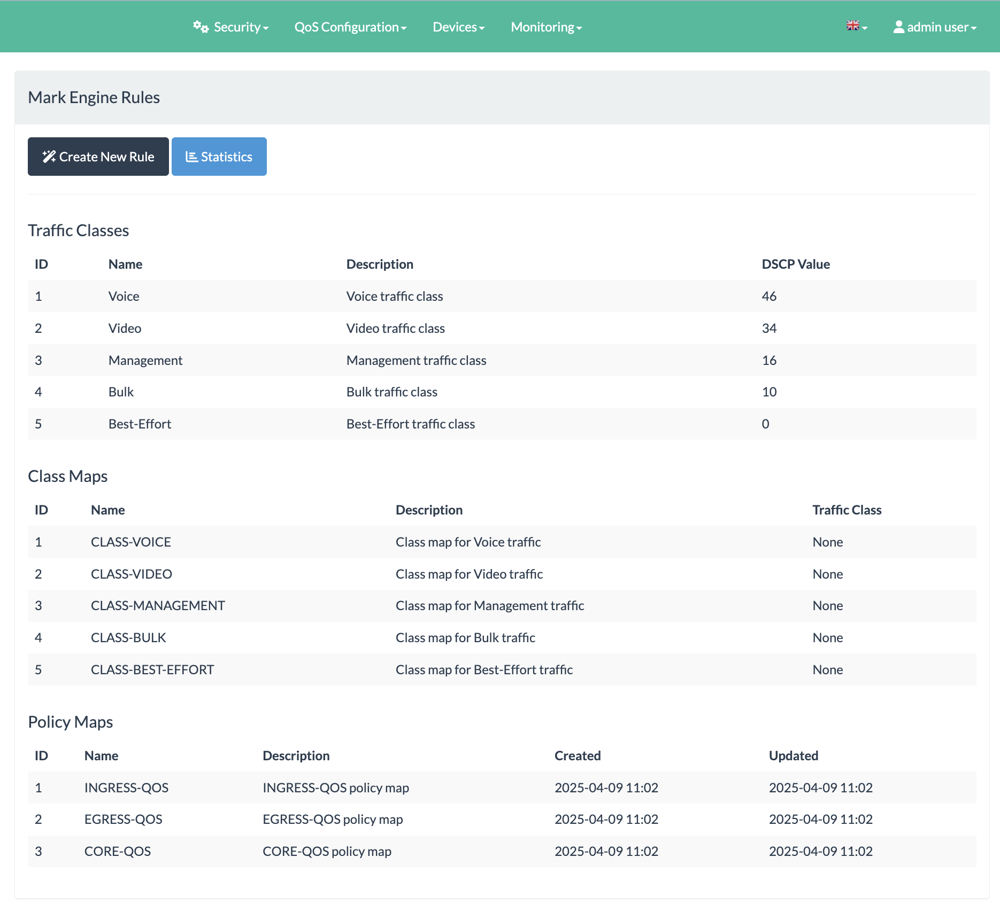
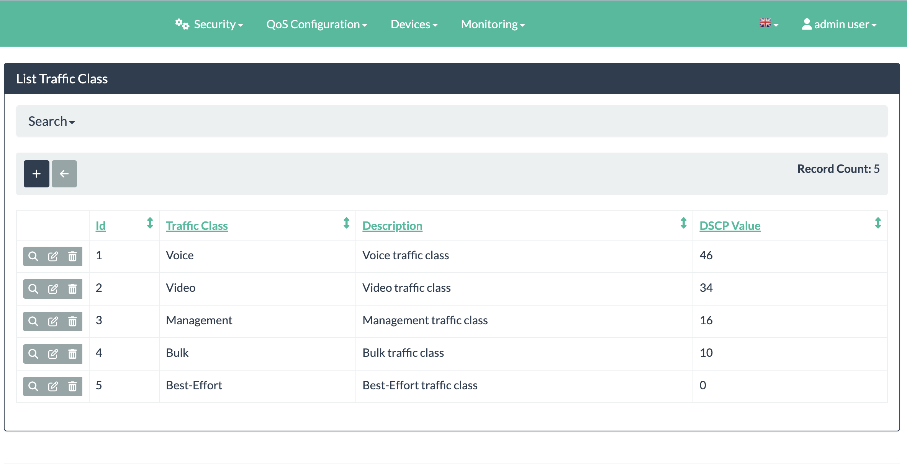
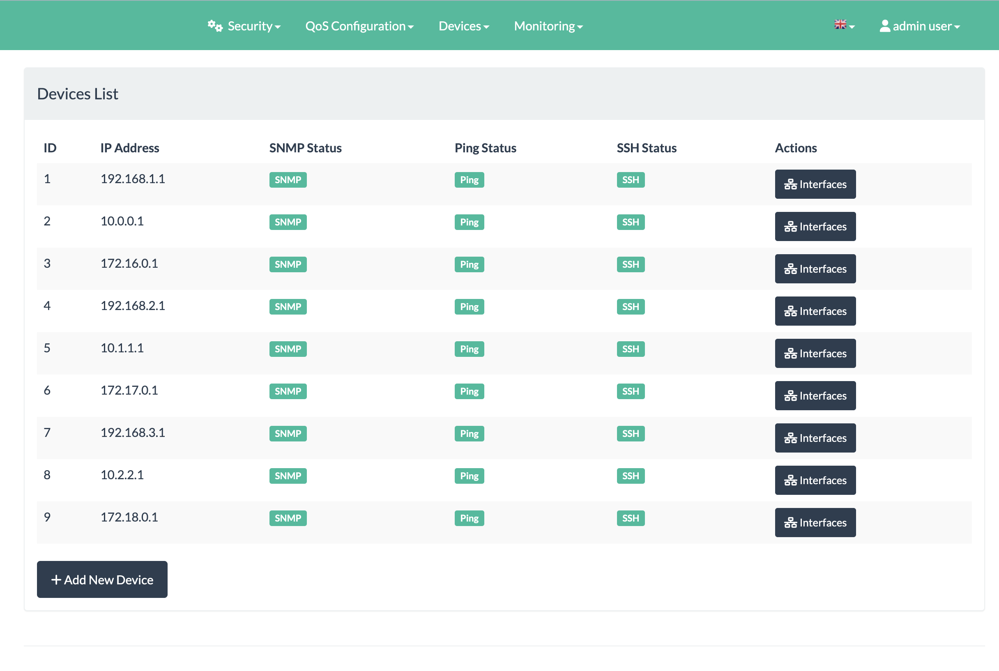
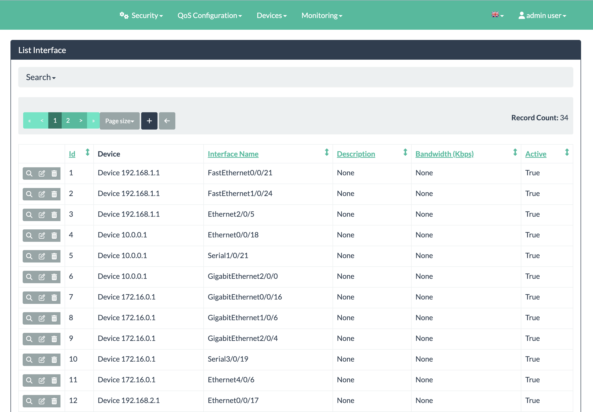
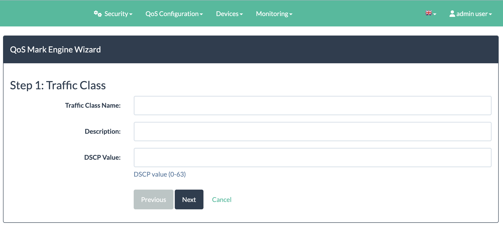
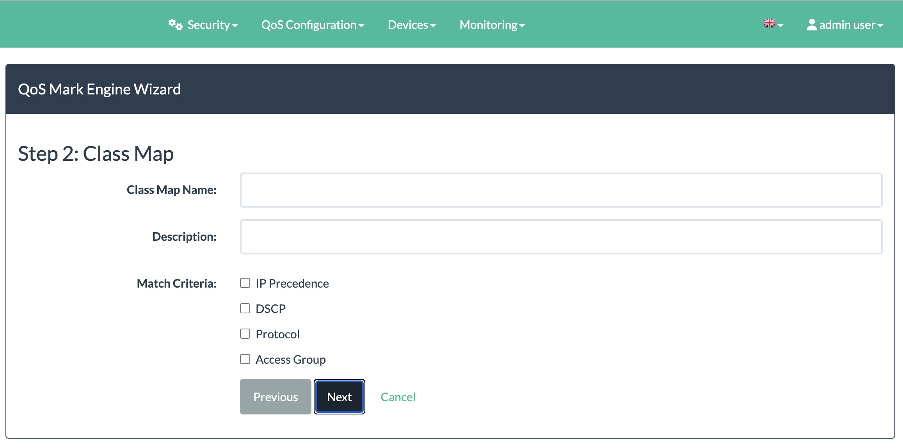
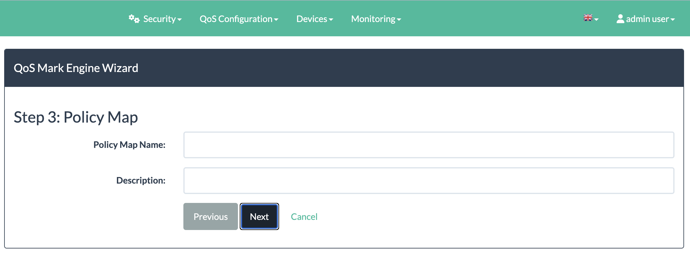
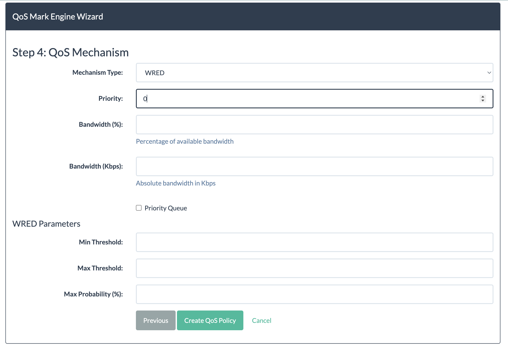
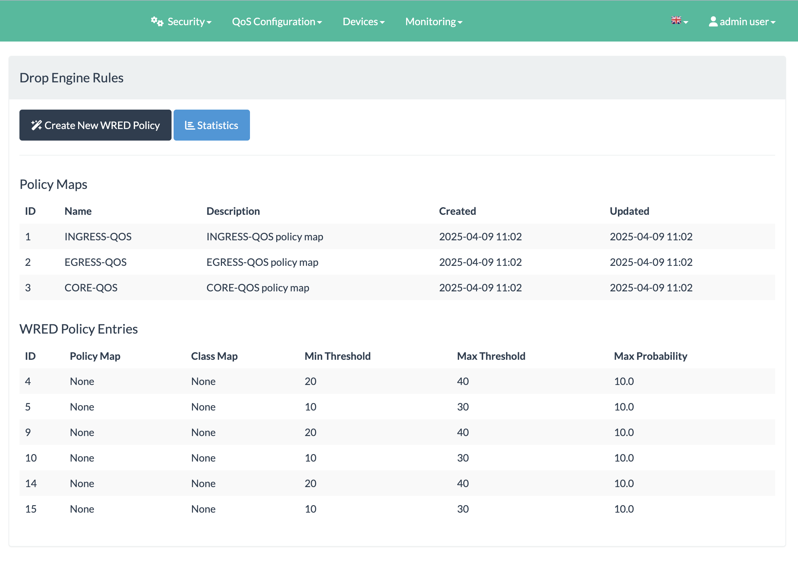
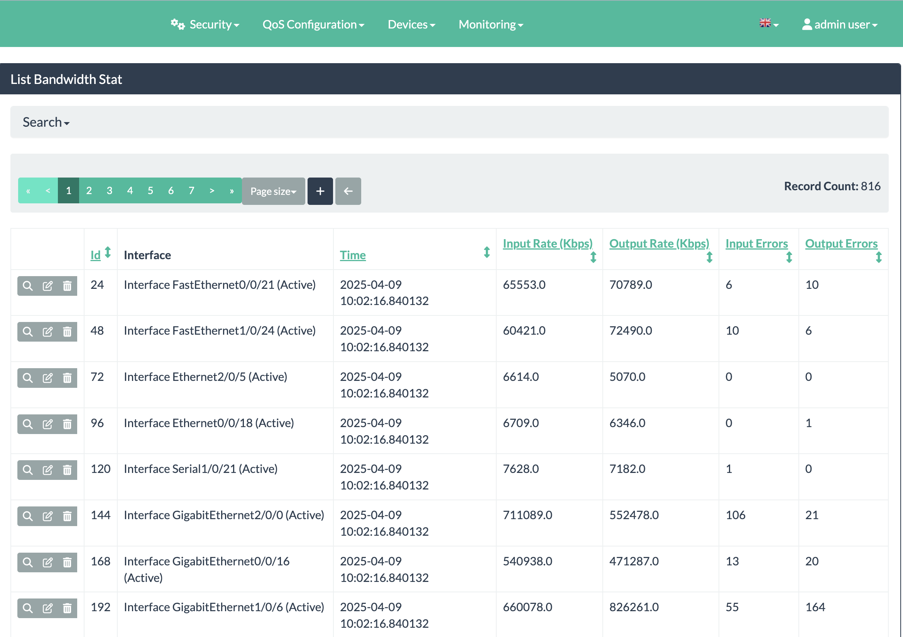

# QoS Bandwidth Optimizer


<div align="center">
  
</div>

## Overview
A Flask application for managing Quality of Service (QoS) policies on network devices. Provides web-based interface for configuring and monitoring QoS settings.


### Cisco Routers and Switches
| Model Series | IOS Version | Notes |
|--------------|-------------|-------|
| Catalyst 2960-X/XS | 15.2+ | Full support |
| Catalyst 3750-X | 15.2+ | Full support |
| Catalyst 3850 | 15.2+ | Full support |
| Catalyst 9300 | 16.9+ | Basic functionality |

**Requirements:**
- SSHv2 access
- SNMP v2c/v3
- QoS capable IOS image


### Architecture
The QoS Bandwidth Optimizer follows a modular architecture:

1. **Web Interface Layer**: Flask-based frontend with Flask-AppBuilder for admin interfaces
2. **Business Logic Layer**: Core QoS policy management and device interaction logic
3. **Device Communication Layer**: SSH and SNMP-based communication with network devices
4. **Data Persistence Layer**: SQLAlchemy ORM with database models for all QoS components


---

## Features

- Centralized inventory of network devices
- Automated discovery of device interfaces via SNMP
- Connection status monitoring (SSH, SNMP, ICMP)
- Bulk operations for multi-device configuration
- Visual policy creation wizards
- Support for CBWFQ, LLQ, and WRED mechanisms
- Traffic classification based on multiple criteria
- Policy validation before deployment
- Automatic CLI command generation
- Real-time interface statistics collection
- Historical bandwidth usage graphs
- Predefined traffic classes for common applications
- Custom traffic class creation
- DSCP marking configuration

---

## Installation

### Prerequisites
- Python 3.8 or higher
- pip and virtualenv
- Network access to managed devices
- SNMP access to devices for monitoring
- SSH access to devices for configuration

```bash
# Clone the repository
git clone https://github.com/teal33t/bandwith-optimizer.git
cd bandwith-optimizer

# Create and activate virtual environment
python -m venv venv
source venv/bin/activate  # Linux/Mac
# venv\Scripts\activate  # Windows

# Install dependencies
pip install -r requirements.txt

# Configure environment
cp .env.example .env
# Edit .env file with your settings

# Initialize database
flask db upgrade
flask initdb

# Start application
flask run
```

### Development Setup
For development environments:

```bash
# Install development dependencies
pip install -r requirements-dev.txt

# Run tests
pytest

# Run with debug mode
flask run --debug
```

---


## CLI Commands

| Command | Description | Options |
|---------|-------------|---------|
| `flask run` | Start development server | `--host`, `--port`, `--debug` |
| `flask initdb` | Initialize database | `--force` to recreate tables |
| `flask fake-add` | Add test data | `--count` for number of devices |
| `flask fake-remove` | Clear test data | `--all` to remove everything |
| `flask db upgrade` | Run database migrations | |
| `flask db downgrade` | Revert database migrations | |
| `flask translate` | Update translations | `--lang` for language |
| `flask routes` | List all application routes | |

### Custom Management Commands
```bash
# Collect bandwidth statistics for all devices
flask collect-stats

# Verify device connectivity
flask check-devices

# Export configuration report
flask export-config --format=pdf
```


---


## Configuration
Environment variables (set in `.env` file):

| Variable | Description | Example |
|----------|-------------|---------|
| `SECRET_KEY` | Application secret key | `your-secret-key-here` |
| `SQLALCHEMY_DATABASE_URI` | Database connection | `sqlite:///app.db` |
| `APP_NAME` | Application name | `QoS Optimizer` |
| `APP_THEME` | UI theme | `dark` or `light` |
| `AUTH_TYPE` | Authentication method | `local` or `ldap` |
| `ENCRYPTION_KEY` | Key for credential encryption | `fernet-key-here` |
| `MRTG_CFG_BASE_PATH` | Path for MRTG configs | `/var/www/mrtg/` |
| `SUDO_PASSWORD` | For MRTG operations (dev only) | `password` |
| `LOG_LEVEL` | Application logging level | `INFO` |
| `DEVICE_TIMEOUT` | Device connection timeout | `30` |

### Database Schema
The application uses the following core models:

- **Device**: Network device information
- **Connection**: SSH/Telnet connection details
- **SNMP**: SNMP configuration for monitoring
- **ICMP**: Ping monitoring configuration
- **Interface**: Network interfaces on devices
- **TrafficClass**: Application traffic categories
- **ClassMap**: Traffic matching criteria
- **PolicyMap**: QoS policy definitions
- **PolicyEntry**: QoS mechanisms within policies
- **PolicyApplication**: Association of policies to interfaces
- **BandwidthStat**: Collected bandwidth statistics

---

## Usage

### Initial Setup
1. Access web interface at `http://localhost:3333`
2. Login with admin credentials (default: admin/admin)
3. Add network devices using device credentials
4. Verify device connectivity (SSH, SNMP, ICMP)
5. Discover device interfaces

### QoS Configuration Workflow
1. Create traffic classes for your applications
2. Define class maps with match criteria
3. Create policy maps with QoS mechanisms
4. Apply policies to device interfaces
5. Verify policy application

### Monitoring
1. View real-time bandwidth statistics
2. Analyze historical usage patterns
3. Check for QoS policy effectiveness
4. Export reports for capacity planning

### Troubleshooting
1. Verify device connectivity status
2. Check interface statistics for errors
3. Review policy application logs
4. Validate QoS configuration on devices

<div align="center">
  
  <p><em>QoS policy configuration interface</em></p>
</div>

---


## Network Topology

```
                   +-------------+
                   | Bandwidth   |
                   | Optimizer   |
                   +------+------+
                          |
                          |
+--------+        +-------+-------+        +--------+
| Router |--------| Core Router   |--------| Router |
| Edge1  |        | (QoS Policies)|        | Edge2  |
+---+----+        +-------+-------+        +----+---+
    |                     |                     |
+---+----+         +-----+------+         +----+---+
| Host1  |         | Host2      |         | Host3  |
| (VoIP) |         | (Video)    |         | (Data) |
+--------+         +------------+         +--------+
```


*Traffic class configuration for QoS policies*

---

## Device Management


*Device management interface showing connected network devices*


*Network interfaces available for QoS configuration*

## QoS Engines


<div align="center">
  
  
  
  
  
  <p><em>Mark Engine advanced configuration options</em></p>
</div>
<div align="center">
  
  <p><em>Drop Engine configuration for packet handling</em></p>
</div>


*Dashboard showing device bandwidth status and utilization*


## Appendix: QoS Terminology

### Quality of Service Mechanisms
- **CBWFQ**: Class-Based Weighted Fair Queuing
- **LLQ**: Low Latency Queuing
- **WRED**: Weighted Random Early Detection
- **DSCP**: Differentiated Services Code Point

### Network Concepts
- **Bandwidth**: Maximum data transfer rate
- **Latency**: Time delay between packets
- **Jitter**: Variation in packet delay
- **Packet Loss**: Percentage of lost packets

### Application Components
- **Traffic Class**: Logical grouping of traffic flows
- **Policy Map**: Collection of QoS policies
- **Class Map**: Traffic classification criteria
- **Marking**: Tagging packets with QoS info

---

## Testing with GNS3

GNS3 (Graphical Network Simulator-3) provides an ideal environment for testing the QoS Bandwidth Optimizer without physical hardware. This guide helps you set up a test environment.

### Prerequisites

- GNS3 2.2.0 or later installed ([Download GNS3](https://www.gns3.com/software/download))
- Cisco IOS images for routers (e.g., c7200, c3745)
- At least 8GB RAM recommended for smooth simulation

### Quick Setup Guide

1. **Create a Test Topology**

   ```
   +-------------+         +------------+         +-------------+
   | QoS Traffic |---------|   Router   |---------|  Bandwidth  |
   | Generator   |         | (Cisco IOS)|         |  Optimizer  |
   +-------------+         +------------+         +-------------+
   ```

   - Add 2-3 Cisco routers (c7200 recommended for QoS support)
   - Connect routers with serial or Ethernet links
   - Add a cloud or NAT object to connect to your host machine
   - Add a simple host to generate traffic

2. **Configure Router IP Addresses**

   ```
   # Example configuration for R1
   Router> enable
   Router# configure terminal
   Router(config)# hostname R1
   R1(config)# interface FastEthernet0/0
   R1(config-if)# ip address 192.168.1.1 255.255.255.0
   R1(config-if)# no shutdown
   R1(config-if)# exit
   ```

3. **Enable SSH on Routers**

   ```
   R1(config)# ip domain-name test.local
   R1(config)# crypto key generate rsa
   R1(config)# username admin privilege 15 secret password
   R1(config)# line vty 0 4
   R1(config-line)# login local
   R1(config-line)# transport input ssh
   R1(config-line)# exit
   ```

4. **Configure SNMP**

   ```
   R1(config)# snmp-server community public RO
   R1(config)# snmp-server location GNS3-Lab
   R1(config)# snmp-server contact admin@test.local
   ```

5. **Connect Bandwidth Optimizer**

   - Ensure your host machine can reach the GNS3 router IPs
   - In the Bandwidth Optimizer app, add devices using the GNS3 router IPs
   - Use the credentials configured in step 3
   - Test connectivity with `flask check-devices`

6. **Generate Test Traffic**

   - Use iperf or similar tools on connected hosts
   - For basic testing:
     ```
     # On traffic generator
     ping 192.168.1.1 -s 1500 -t 1000
     ```

7. **Apply and Test QoS Policies**

   - Create traffic classes for different protocols
   - Define QoS policies through the web interface
   - Apply policies to router interfaces
   - Monitor bandwidth statistics with `flask collect-stats`
   - Generate traffic and observe the effects of QoS policies

### Troubleshooting

- **Connection Issues**: Ensure GNS3 is properly configured to allow host-to-VM communication
- **SNMP Failures**: Verify SNMP community strings match between router and application
- **SSH Timeouts**: Check that VTY lines are properly configured for SSH access
- **Performance Issues**: Reduce the number of simultaneous devices if GNS3 becomes slow

### Recommended Test Scenarios

1. **Congestion Testing**: Generate traffic exceeding link capacity to test QoS prioritization
2. **Voice/Video Priority**: Test LLQ with simulated voice traffic
3. **Bandwidth Allocation**: Verify CBWFQ percentages are properly applied
4. **Packet Drop**: Test WRED functionality under congestion

For more detailed GNS3 setup instructions, refer to the [GNS3 Documentation](https://docs.gns3.com/).


---


## ⚠️ Cautions and Disclaimers

This application is optimized for small to medium-sized networks** (up to ~50 devices) and is ideal for branch offices, small campuses, or departmental networks.

### Legal Disclaimer
This software is provided "as is", without warranty of any kind, express or implied. The authors and contributors are not liable for any damages or network outages resulting from the use of this software. Users are responsible for testing and validating all configurations before deployment to production environments.

By using this application, you acknowledge that modifying network device configurations carries inherent risks, and you accept responsibility for changes made to your network infrastructure.
